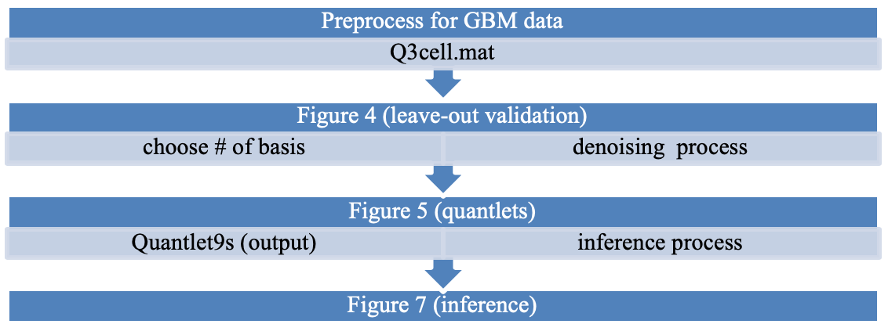

# Quantile Function on Scalar Regression Analysis for Distributional Data

# Author Contributions Checklist Form

## Data 

### Abstract 

Glioblastoma multiforme (GBM) is the most common and most aggressive cancer that begins within the brain. Most GBM diagnoses are made by medical imaging such as magnetic resonance imaging (MRI), where MRI offers a wide range of high-resolution image contrast that can serve as indicators for clinical decision making or for tumor progression in GBM studies. A GBM tumor, which usually originates from a single cell, demonstrates heterogeneous physiological and morphological features as it proliferates. Those heterogeneous features make it difficult to predict treatment impacts and outcomes for patients with GBM. It is of scientific interest to identify the association between characteristics originating from tumor heterogeneity and clinical measurements within an integrated model. Thus, our primary goal is to assess how variability in image intensities in the tumor relate with various clinical, demographic, and genetic factors.

### Availability 

Data is available. 

### Description 

For our GBM case study, we collated radiologic images along with linked genomic and clinical data from 64 patient samples consented under the TCGA protocols (http://cancergenome.nih.gov/). The imaging data consisting of pre-surgical T1-weighted post contrast for these 64 patients were obtained from The Cancer Imaging Archive (http://www.cancerimagingarchive.net/ ). The dataset including survival, clinical and genomic data for these subjects were obtained from cBioPortal (http://www.cbioportal.org/ ).

We used the covariates including sex (21 females, 43 males), age (mean 56.5 years), DDIT3 gene mutation (6 yes, 58 no), EGFR gene mutation (24 yes, 40 no), GBM subtype (30 mesenchymal, 34 other), and survival status (25 less than 12 months, 39 greater than or equal to 12 months). The dataset and codes for our study are freely accessible from the “Web-based Supplementary Materials”. Specifically, we uploaded three data files named by “Q3cell.mat”, which includes the raw-pixel intensities corresponding to the tumor, named by “Qy_1024.csv”, which includes the empirical quantiles based on the regular probability grids for the original data (“Q3cell.mat”), and named by “Q3_covariates.csv” which includes the covariates information for each patient.
 

## Code

### Abstract 

We develop a quantile function on scalar regression modeling framework that models the marginal distribution of the subject-specific observations through the quantile function, which is regressed on a set of covariates to determine how these factors affect various aspects of the underlying subject-specific distribution. To account for smoothness in the quantile functions, we introduce custom basis functions and we call quantlets that are sparse, regularized, and near-lossless. While these quantlets could be used within various functional regression frameworks, we build a Bayesian framework that uses nonlinear shrinkage of quantlet coefficients to regularize the functional regression coefficients and allows fully Bayesian inferences after fitting a Markov chain Monte Carlo (MCMC). 

### Description 

For the quantlets basis function, we construct an overcomplete dictionary that contains bases spanning the space of Gaussian quantile functions plus a large number of Beta cumulative density functions, Then, we use the lasso regression to choose a sparse set among these dictionary elements and find a near-lossless subset by the cross-validated concordance correlation coefficient. Finally, we orthogonalize this subset using Gram-Schmidt, apply wavelet denoising to regularize the orthogonal basis functions, and then re-standardize. Once we obtain the quantlets basis function, we can deal with them as the basis function and develop them to fit the functional regression model. As described in the paper, we fit the quantlet space model using MCMC. From these posterior samples, various Bayesian inferential quantities can be computed, including point wise and joint credible bands, global Bayesian p-values,and multiplicity-adjusted probability scores. The quantlets function requires the glmnmet function in glmnet R package (Friedman, Hastie and Tibshirani 2010: v 2.0-16) to figure out the dictionary, gramSchmidt function in pracma R package (Borchers 2015: v 2.1.4) to obtain the orthonormal set for the common basis set, and wst function in wavethresh R package (Nason 2010: v 4.6.8) to utilize the non-decimated wavelet shrinkage method after the set of the overcomplete dictionary. For the purpose of sampling, computation and comparison, we also use sn (Azzalini, 2018: v 1.5-2), mvtnorm (Genz et al, 2018: v 1.0-7), Mass (Ripley et al, 2018: v 7.3-49), survival (Therneau et al, 2018: v 2.41-3), moments (Komsta et al, 2015: v 0.14), R.matlab (Bengtsson et al, 2018: v 3.6.1) and matrixcalc (Novomestky, 2012: v 1.0-3) R packages.

### Optional Information 

We used R version 3.5.0.

## Instructions for use

### Reproducibility 

We reproduce Figures 3, 4, 6, 7 and Table 4 as the results for the GBM case study, where all results are contained in the script named as “ACS_reproduce_application.R” because almost procedures are successively related to each other. We summarize workflow information as the following.   

Table 4 can be reproduced from the results of the inference, which we added the last line in “ACS_reproduce_application.R”. Expected run-time of the workflow is roughly 60 mins consisting of 32 mins for finding the sparse sets, 22 mins for computing the cross-validation, and 6 mins for running the MCMC and computing inference from the posterior samples. 

We reproduce Figures 5 and Tables 2 and 3 as the results for the simulation study, where all results are contained in the script named as “ACS_reproduce_simulation.R”. To obtain desired results, the expected run-time is roughly 53 mins consisting of 15 mins for finding the quantlets basis, 13 mins for computing cross-validation, and 25 mins for posterior samples and inferential summaries. 
